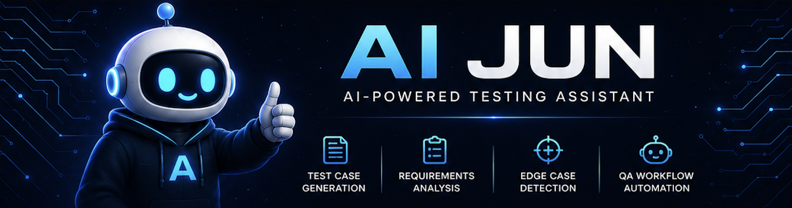
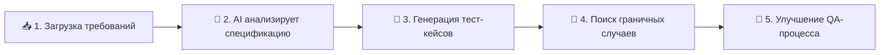
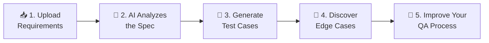

<!-- ====================================================================== -->
<!--                              AI JUN                                    -->
<!-- ====================================================================== -->

<div align="center">



<br/>

# 🤖 AI JUN

### **AI-копилот для QA-инженеров**

*AI-ассистент для анализа требований, генерации тест-кейсов и поиска граничных случаев.*


[](https://spring.io/projects/spring-boot)
[](https://nextjs.org/)
[](https://ollama.com/)
[](https://www.docker.com/)
[](https://github.com/google-a2a/A2A)

<br/>

**🇷🇺 Русский** · [🇺🇸 English](#-ai-jun--english-version)

<br/>

[**🚀 Быстрый старт**](#-быстрый-старт) · [**✨ Фичи**](#-фичи) · [**🏗️ Архитектура**](#%EF%B8%8F-архитектура) · [**🗺️ Дорожная карта**](#%EF%B8%8F-дорожная-карта) · [**🤝 Контрибьютинг**](#-контрибьютинг)

</div>

<br/>

---

## 🌟 Видение

> ### *«Наша миссия — создать AI-копилота, о котором мечтает каждый QA-инженер.»*

QA — это фундамент качественного ПО, но QA-инженеры тратят бесчисленные часы на повторяющийся анализ, ручное проектирование тестов и поиск граничных случаев, которые легко упустить. **AI JUN** меняет это.

Мы верим, что инженерия качества должна быть **быстрее, умнее и креативнее**. AI JUN работает как неутомимый напарник-тестировщик: он читает ваши требования, рассуждает о рисках и за секунды создаёт структурированные, готовые к ревью тестовые артефакты — чтобы вы могли сосредоточиться на том, что лучше всего удаётся людям.

<br/>

---

## ✨ Фичи

<table>
<tr>
<td width="50%" valign="top">

### 🧪 Генерация тест-кейсов
Создавайте структурированные, готовые к ревью наборы тестов — позитивные, негативные, граничные, безопасностные и нагрузочные — за секунды.

</td>
<td width="50%" valign="top">

### 📄 Анализ требований
Загрузите пользовательскую историю или спецификацию — AI JUN извлечёт тестируемое поведение, критерии приёмки и замысел.

</td>
</tr>
<tr>
<td width="50%" valign="top">

### 🐞 Поиск граничных случаев
Выявляйте сложные граничные условия и сценарии отказов, которые ручное ревью часто упускает.

</td>
<td width="50%" valign="top">

### ⚡ Оптимизация QA-процессов
Радикально сокращайте время подготовки и стандартизируйте проектирование тестов во всей команде.

</td>
</tr>
<tr>
<td width="50%" valign="top">

### 🤖 AI-ассистент
Диалоговый копилот, который понимает контекст QA и помогает рассуждать о качестве.

</td>
<td width="50%" valign="top">

### 🔍 Выявление рисков
Автоматически отмечайте неоднозначности, недостающие требования и потенциальные точки отказа.

</td>
</tr>
<tr>
<td width="50%" valign="top">

### 📊 Рекомендации по покрытию
Получайте конкретные предложения о том, где покрытие тестами недостаточно и как его усилить.

</td>
<td width="50%" valign="top">

### 🚀 Рост продуктивности
Выпускайте более качественное ПО быстрее — без расширения команды и выгорания.

</td>
</tr>
</table>

<br/>

---

## ⚙️ Как это работает



| Шаг | Что происходит |
|:---|:---|
| **1️⃣ Загрузка требований** | Отправьте пользовательскую историю, спецификацию фичи или документ с требованиями. |
| **2️⃣ AI анализирует спецификацию** | AI JUN разбирает замысел, критерии приёмки и тестируемое поведение. |
| **3️⃣ Генерация тест-кейсов** | Создаётся структурированный набор: `TC-NNN | Название | Предусловия | Шаги | Ожидаемый результат | Приоритет`. |
| **4️⃣ Поиск граничных случаев** | Выявляются граничные, негативные, безопасностные и нагрузочные сценарии. |
| **5️⃣ Улучшение QA-процесса** | Просматривайте, экспортируйте и интегрируйте результаты в свой рабочий процесс. |

<br/>

---

## 💡 Почему AI JUN

<table>
<tr>
<th width="50%">😩 Традиционные проблемы QA</th>
<th width="50%">✅ Подход AI JUN</th>
</tr>
<tr>
<td valign="top">

- **Ручной анализ** каждого требования
- **Повторяющееся проектирование** тестов для похожих фич
- **Пропущенные граничные случаи**, найденные слишком поздно
- **Долгая подготовка** перед тем, как тестирование вообще начнётся
- Непостоянное качество у разных членов команды

</td>
<td valign="top">

- **Мгновенный анализ** требований с помощью AI
- **Автоматическая генерация** тестов в едином формате
- **Проактивный поиск** граничных случаев до релиза
- **Секунды, а не часы** до готового к ревью набора
- Общая, стандартизированная база качества

</td>
</tr>
</table>

<br/>

---

## 🏗️ Архитектура

AI JUN построен на мультиагентной основе с использованием **[протокола A2A (Agent-to-Agent)](https://github.com/google-a2a/A2A)**. Host Orchestrator параллельно распределяет требования между специализированными AI-агентами, затем агрегирует и сохраняет результаты.

```
┌──────────────────────────────────────────────────────────┐
│                  🖥️  ФРОНТЕНД  ·  a2a-ui (:3000)         │
│              Next.js 15  ·  MUI 7  ·  TypeScript         │
└───────────────────────────┬──────────────────────────────┘
                            │ HTTP / REST
┌───────────────────────────▼──────────────────────────────┐
│              🧩  БЭКЕНД  ·  Host Orchestrator (:8080)    │
│        Spring Boot 3  ·  JPA  ·  H2 / PostgreSQL         │
│   POST /api/analyze · GET /api/history · GET /api/agents │
│   Resilience4j: CircuitBreaker → TimeLimiter → Retry     │
└──────────────┬─────────────────────────────┬─────────────┘
   A2A JSON-RPC│                             │ A2A JSON-RPC
┌───────────────▼───────────┐   ┌──────────────▼─────────────┐
│  🧪 Tester Agent (:8081)  │   │  🔍 Analyst Agent (:8082)  │
│  Генерация тест-кейсов    │   │  Анализ рисков и неясностей│
│  Spring Boot 3 + Spring AI│   │  Spring Boot 3 + Spring AI │
└───────────────┬───────────┘   └──────────────┬─────────────┘
               │                             │
        ┌───────▼─────────────────────────────▼───────┐
        │         🧠  AI-СЛОЙ  ·  Ollama (:11434)     │
        │     Локальный LLM-инференс  ·  qwen2.5:7b   │
        └─────────────────────────────────────────────┘
```

<details>
<summary><b>📦 Разбор по слоям</b></summary>

<br/>

| Слой | Технологии | Ответственность |
|---|---|---|
| **Frontend** | Next.js 15, MUI 7, TypeScript | Веб-интерфейс для отправки требований и просмотра результатов |
| **Backend** | Spring Boot 3, JPA, H2/PostgreSQL | Оркестрация, персистентность, REST + A2A эндпоинты, отказоустойчивость |
| **AI-слой** | Spring AI, Ollama (qwen2.5:7b) | Локальный LLM-инференс — данные не покидают вашу машину |
| **Интеграции** | Протокол A2A (JSON-RPC 2.0) | Обнаружение агентов и межсервисное взаимодействие |

**Отказоустойчивость:** Вызовы агентов проходят через цепочку Resilience4j — **CircuitBreaker → TimeLimiter (30с) → Retry (3×, экспоненциальная задержка)** — с корректным fallback, когда агент недоступен.

</details>

<br/>

---

## 📦 Установка

> ### ⚡ Запуск одной командой
> **Нужен только установленный [Docker](https://www.docker.com/products/docker-desktop/) — больше ничего.** Ни Java, ни Node.js, ни Ollama ставить не надо: всё поднимется в контейнерах.

```bash
# 1. Клонируйте репозиторий
git clone https://github.com/limberli/aijun.git
cd aijun

# 2. Запустите лаунчер
./run.sh          # macOS / Linux
# или на Windows:
run.bat
```

Скрипт `run.sh` сам:
1. 🌍 Спросит язык (Русский / English).
2. ⚙️ Предложит режим: **Groq** (облачный LLM, быстро, нужен бесплатный API-ключ) или **Ollama** (локальная модель `phi3:mini`, без ключа, медленнее).
3. 🐳 Проверит, что Docker установлен и запущен.
4. 🏗️ Соберёт и поднимет весь стек (`docker compose ... up --build -d`).
5. ⏳ Дождётся готовности сервисов и **сам откроет UI** → `http://localhost:3000`.

Остановить стек:

```bash
./stop.sh         # macOS / Linux
stop.bat          # Windows
```

<details>
<summary><b>🛠️ Ручной запуск и сборка для разработчиков</b></summary>

<br/>

**Требования (только для ручной сборки):**

| Требование | Версия |
|---|---|
| 🐳 Docker и Docker Compose | актуальная |
| ☕ Java (JDK) | 21+ |
| 🟢 Node.js (для разработки UI) | 20+ |

**Вариант A — Docker Compose напрямую**

```bash
# Полный стек (загрузит qwen2.5:7b, выполнит healthcheck)
docker compose up --build

# Полегче — модель phi3:mini, быстрый старт:
docker compose -f docker-compose-simple.yml up --build
```

**Вариант B — Локальная сборка**

```bash
# Соберите все backend-модули
mvn package -DskipTests

# Запустите UI в режиме разработки
cd a2a-ui
npm install
npm run dev
```

</details>

<br/>

---

## 🚀 Быстрый старт

После запуска стека отправьте документ с требованиями оркестратору:

```bash
curl -X POST http://localhost:8080/api/analyze \
  -H "Content-Type: application/json" \
  -d '{
    "document": "Как пользователь, я хочу сбрасывать пароль по email, чтобы восстановить доступ к аккаунту."
  }'
```

**Ответ:**

```json
{
  "conversationId": "a1b2c3d4-...",
  "testerResponse": "TC-001 | Успешный сброс пароля | Пользователь существует ... | Высокий\nTC-002 | Истёкший токен сброса | ...",
  "analystResponse": "⚠️ Неоднозначность: не указано время жизни токена.\n⚠️ Отсутствует: требование к rate-limiting для запросов сброса.",
  "analyzedAt": "2026-06-03T12:00:00Z"
}
```

**Что ещё посмотреть:**

| Эндпоинт | Назначение |
|---|---|
| `🌐 http://localhost:3000` | Веб-интерфейс |
| `📜 http://localhost:8080/swagger-ui` | Интерактивная документация API |
| `🕓 GET /api/history` | Постраничная история обращений |
| `🃏 GET /.well-known/agent-card.json` | Эндпоинт обнаружения A2A |

> 📖 Подробные технические детали, команды сборки и информацию об интеграционных тестах см. в [**docs/DEVELOPMENT.md**](docs/DEVELOPMENT.md).

<br/>

---

## 🗺️ Дорожная карта

### ✅ Уже доступно

- [x] 📄 Анализ требований
- [x] 🧪 Генерация тест-кейсов
- [x] 🐞 Поиск граничных случаев
- [x] 🔍 Выявление рисков и неоднозначностей

### 🔜 В планах

- [ ] 🖥️ Десктопное приложение
- [ ] 💬 Telegram-бот
- [ ] 🎫 Интеграция с Jira
- [ ] 🧩 Браузерное расширение
- [ ] 🤖 Полноценный диалоговый AI QA-копилот
- [ ] 👥 Командная работа и общие рабочие пространства

<br/>

---

## 🌍 Сообщество

<div align="center">

[](https://github.com/limberli/aijun)
[](https://t.me/ai_jun)
[](https://linkedin.com/in/limberli)
[](https://aijun.tech)

</div>

> ⭐ **Если AI JUN вам полезен — поставьте звезду.** Это реально помогает проекту расти и находить больше QA-инженеров.

<br/>

---

## 🤝 Контрибьютинг

Мы ❤️ контрибьюции! Будь то исправление бага, новая фича, документация или фидбэк — мы вам рады.

```bash
# 1. Сделайте форк и клонируйте
git clone https://github.com/your-username/ai-jun.git

# 2. Создайте ветку для фичи
git checkout -b feat/amazing-feature

# 3. Закоммитьте изменения
git commit -m "feat: add amazing feature"

# 4. Запушьте и откройте Pull Request
git push origin feat/amazing-feature
```

**Рекомендации:**

- 🔍 Для крупных изменений сначала откройте issue, чтобы обсудить направление.
- ✅ Убедитесь, что тесты проходят: `mvn test -pl host-orchestrator`.
- 📝 Используйте conventional commits (`feat:`, `fix:`, `docs:`, `chore:`).
- 🎨 Соблюдайте стиль кода соседних модулей.

Полную инструкцию по настройке окружения разработчика см. в [**docs/DEVELOPMENT.md**](docs/DEVELOPMENT.md).

<br/>

---

## 📄 Лицензия

Распространяется по **лицензии MIT**. Подробнее см. в файле [`LICENSE`](LICENSE).

<br/>

<div align="center">

**Сделано с ❤️ для QA-инженеров по всему миру.**

*Если качество — ваше ремесло, AI JUN — ваш копилот.*

[⬆ Наверх](#-ai-jun)

</div>

<br/>
<br/>

<!-- ====================================================================== -->
<!--                       ENGLISH VERSION / АНГЛИЙСКАЯ                      -->
<!-- ====================================================================== -->

---

<div align="center">


<br/>

# 🤖 AI JUN — English version

### **AI Copilot for QA Engineers**

*An AI assistant for requirements analysis, test case generation, and edge case discovery.*

[](https://spring.io/projects/spring-boot)
[](https://nextjs.org/)
[](https://ollama.com/)
[](https://www.docker.com/)
[](https://github.com/google-a2a/A2A)

<br/>

[🇷🇺 Русский](#-ai-jun) · **🇺🇸 English**

<br/>

[**🚀 Quick Start**](#-quick-start) · [**✨ Features**](#-features) · [**🏗️ Architecture**](#%EF%B8%8F-architecture) · [**🗺️ Roadmap**](#%EF%B8%8F-roadmap) · [**🤝 Contributing**](#-contributing)

</div>

<br/>

---

## 🌟 Vision

> ### *"Our mission is to build the AI copilot every QA engineer dreams of."*

QA is the backbone of great software — yet QA engineers spend countless hours on repetitive analysis, manual test design, and chasing edge cases that are easy to miss. **AI JUN** changes that.

We believe quality engineering should be **faster, smarter, and more creative**. AI JUN acts as a tireless pair-tester: it reads your requirements, reasons about risk, and produces structured, review-ready test artifacts in seconds — so you can focus on what humans do best.

<br/>


---

## ✨ Features

<table>
<tr>
<td width="50%" valign="top">

### 🧪 Test Case Generation
Generate structured, review-ready test suites — positive, negative, boundary, security, and load cases — in seconds.

</td>
<td width="50%" valign="top">

### 📄 Requirements Analysis
Feed in a user story or spec and let AI JUN extract testable behaviors, acceptance criteria, and intent.

</td>
</tr>
<tr>
<td width="50%" valign="top">

### 🐞 Edge Case Discovery
Surface the tricky boundary conditions and failure modes that manual review tends to miss.

</td>
<td width="50%" valign="top">

### ⚡ QA Process Optimization
Cut prep time dramatically and standardize your test design across the whole team.

</td>
</tr>
<tr>
<td width="50%" valign="top">

### 🤖 AI Assistant
A conversational copilot that understands QA context and helps you reason about quality.

</td>
<td width="50%" valign="top">

### 🔍 Risk Detection
Automatically flag ambiguities, missing requirements, and potential points of failure.

</td>
</tr>
<tr>
<td width="50%" valign="top">

### 📊 Coverage Recommendations
Get actionable suggestions on where your test coverage is thin and how to strengthen it.

</td>
<td width="50%" valign="top">

### 🚀 Productivity Boost
Ship higher-quality software faster — without growing the team or burning out.

</td>
</tr>
</table>

<br/>

---

## ⚙️ How It Works



| Step | What happens |
|:---|:---|
| **1️⃣ Upload Requirements** | Submit a user story, feature spec, or requirements document. |
| **2️⃣ AI Analyzes the Spec** | AI JUN parses intent, acceptance criteria, and testable behaviors. |
| **3️⃣ Generate Test Cases** | A structured suite is produced: `TC-NNN | Title | Preconditions | Steps | Expected Result | Priority`. |
| **4️⃣ Discover Edge Cases** | Boundary, negative, security, and load scenarios are surfaced. |
| **5️⃣ Improve Your QA Process** | Review, export, and integrate the results into your workflow. |

<br/>

---

## 💡 Why AI JUN

<table>
<tr>
<th width="50%">😩 The Traditional QA Struggle</th>
<th width="50%">✅ The AI JUN Way</th>
</tr>
<tr>
<td valign="top">

- **Manual analysis** of every requirement
- **Repetitive test design** for similar features
- **Missed edge cases** discovered too late in prod
- **Long prep time** before testing can even start
- Inconsistent quality across team members

</td>
<td valign="top">

- **Instant analysis** of requirements with AI
- **Automated test generation** in a consistent format
- **Proactive edge case discovery** before release
- **Seconds, not hours** to a review-ready suite
- A shared, standardized quality baseline

</td>
</tr>
</table>

<br/>

---

## 🏗️ Architecture

AI JUN is built on a multi-agent backbone using the **[A2A (Agent-to-Agent) Protocol](https://github.com/google-a2a/A2A)**. A Host Orchestrator fans requirements out in parallel to specialized AI agents, then aggregates and persists the results.

```
┌──────────────────────────────────────────────────────────┐
│                  🖥️  FRONTEND  ·  a2a-ui (:3000)         │
│              Next.js 15  ·  MUI 7  ·  TypeScript         │
└───────────────────────────┬──────────────────────────────┘
                            │ HTTP / REST
┌───────────────────────────▼──────────────────────────────┐
│              🧩  BACKEND  ·  Host Orchestrator (:8080)   │
│        Spring Boot 3  ·  JPA  ·  H2 / PostgreSQL         │
│   POST /api/analyze · GET /api/history · GET /api/agents │
│   Resilience4j: CircuitBreaker → TimeLimiter → Retry     │
└──────────────┬─────────────────────────────┬─────────────┘
   A2A JSON-RPC │                             │ A2A JSON-RPC
┌───────────────▼───────────┐   ┌──────────────▼─────────────┐
│  🧪 Tester Agent (:8081)  │   │  🔍 Analyst Agent (:8082)  │
│  Test case generation     │   │  Risk & ambiguity analysis │
│  Spring Boot 3 + Spring AI│   │  Spring Boot 3 + Spring AI │
└───────────────┬───────────┘   └──────────────┬─────────────┘
               │                             │
        ┌───────▼─────────────────────────────▼───────┐
        │          🧠  AI LAYER  ·  Ollama (:11434)   │
        │     Local LLM inference  ·  qwen2.5:7b      │
        └─────────────────────────────────────────────┘
```

<details>
<summary><b>📦 Layer breakdown</b></summary>

<br/>

| Layer | Technology | Responsibility |
|---|---|---|
| **Frontend** | Next.js 15, MUI 7, TypeScript | Web UI for submitting requirements and reviewing results |
| **Backend** | Spring Boot 3, JPA, H2/PostgreSQL | Orchestration, persistence, REST + A2A endpoints, resilience |
| **AI Layer** | Spring AI, Ollama (qwen2.5:7b) | Local LLM inference — no data leaves your machine |
| **Integrations** | A2A Protocol (JSON-RPC 2.0) | Agent discovery & inter-service communication |

**Resilience:** Calls to agents flow through a Resilience4j chain — **CircuitBreaker → TimeLimiter (30s) → Retry (3×, exponential back-off)** — with a graceful fallback when an agent is unavailable.

</details>

<br/>

---

## 📦 Installation

> ### ⚡ One-command launch
> **All you need is [Docker](https://www.docker.com/products/docker-desktop/) installed — nothing else.** No Java, no Node.js, no Ollama required: everything runs in containers.

```bash
# 1. Clone the repository
git clone https://github.com/limberli/aijun.git
cd aijun

# 2. Run the launcher
./run.sh          # macOS / Linux
# or on Windows:
run.bat
```

The `run.sh` script will:
1. 🌍 Ask for a language (Русский / English).
2. ⚙️ Offer a mode: **Groq** (cloud LLM, fast, needs a free API key) or **Ollama** (local `phi3:mini` model, no key, slower).
3. 🐳 Verify Docker is installed and running.
4. 🏗️ Build and start the whole stack (`docker compose ... up --build -d`).
5. ⏳ Wait until services are ready and **open the UI for you** → `http://localhost:3000`.

Stop the stack:

```bash
./stop.sh         # macOS / Linux
stop.bat          # Windows
```

<details>
<summary><b>🛠️ Manual launch & build for developers</b></summary>

<br/>

**Prerequisites (manual build only):**

| Requirement | Version |
|---|---|
| 🐳 Docker & Docker Compose | latest |
| ☕ Java (JDK) | 21+ |
| 🟢 Node.js (for UI dev) | 20+ |

**Option A — Docker Compose directly**

```bash
# Full stack (pulls qwen2.5:7b, runs healthchecks)
docker compose up --build

# Lighter — phi3:mini model, faster startup:
docker compose -f docker-compose-simple.yml up --build
```

**Option B — Local build**

```bash
# Build all backend modules
mvn package -DskipTests

# Run the UI in dev mode
cd a2a-ui
npm install
npm run dev
```

</details>

<br/>

---

## 🚀 Quick Start

Once the stack is running, submit a requirements document to the orchestrator:

```bash
curl -X POST http://localhost:8080/api/analyze \
  -H "Content-Type: application/json" \
  -d '{
    "document": "As a user, I want to reset my password via email so I can regain access to my account."
  }'
```

**Response:**

```json
{
  "conversationId": "a1b2c3d4-...",
  "testerResponse": "TC-001 | Valid password reset | User exists ... | High\nTC-002 | Expired reset token | ...",
  "analystResponse": "⚠️ Ambiguity: token expiry window not specified.\n⚠️ Missing: rate-limiting requirement for reset requests.",
  "analyzedAt": "2026-06-03T12:00:00Z"
}
```

**Explore more:**

| Endpoint | Purpose |
|---|---|
| `🌐 http://localhost:3000` | Web UI |
| `📜 http://localhost:8080/swagger-ui` | Interactive API docs |
| `🕓 GET /api/history` | Paginated conversation history |
| `🃏 GET /.well-known/agent-card.json` | A2A discovery endpoint |

> 📖 For deeper technical details, build commands, and integration test info, see [**docs/DEVELOPMENT.md**](docs/DEVELOPMENT.md).

<br/>

---

## 🗺️ Roadmap

### ✅ Available now

- [x] 📄 Requirements analysis
- [x] 🧪 Test case generation
- [x] 🐞 Edge case discovery
- [x] 🔍 Risk & ambiguity detection

### 🔜 On the horizon

- [ ] 🖥️ Desktop application
- [ ] 💬 Telegram bot
- [ ] 🎫 Jira integration
- [ ] 🧩 Browser extension
- [ ] 🤖 Full conversational AI QA copilot
- [ ] 👥 Team collaboration & shared workspaces

<br/>

---

## 🌍 Community

<div align="center">

[](https://github.com/limberli/aijun)
[](https://t.me/ai_jun)
[](https://linkedin.com/in/limberli)
[](https://aijun.tech)

</div>

> ⭐ **If AI JUN helps you, give it a star** — it genuinely helps the project grow and reach more QA engineers.

<br/>

---

## 🤝 Contributing

We ❤️ contributions! Whether it's a bug fix, a new feature, docs, or feedback — you're welcome here.

```bash
# 1. Fork & clone
git clone https://github.com/your-username/ai-jun.git

# 2. Create a feature branch
git checkout -b feat/amazing-feature

# 3. Commit your changes
git commit -m "feat: add amazing feature"

# 4. Push and open a Pull Request
git push origin feat/amazing-feature
```

**Guidelines:**

- 🔍 Open an issue first for major changes to discuss direction.
- ✅ Make sure tests pass: `mvn test -pl host-orchestrator`.
- 📝 Follow conventional commits (`feat:`, `fix:`, `docs:`, `chore:`).
- 🎨 Keep code style consistent with the surrounding modules.

See [**docs/DEVELOPMENT.md**](docs/DEVELOPMENT.md) for the full developer setup.

<br/>

---

## 📄 License

Distributed under the **MIT License**. See [`LICENSE`](LICENSE) for more information.

<br/>

<div align="center">

**Built with ❤️ for QA Engineers everywhere.**

*If quality is your craft, AI JUN is your copilot.*

[⬆ Back to top](#-ai-jun--english-version)

</div>